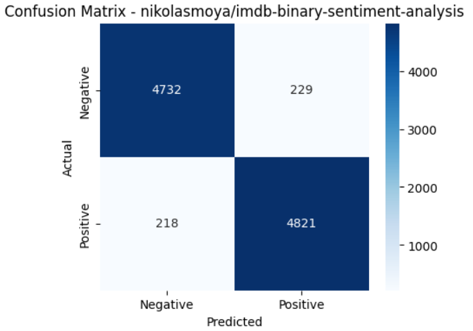
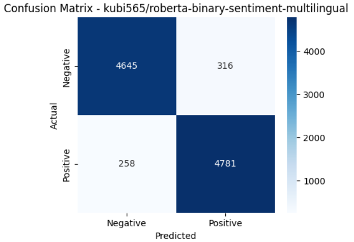
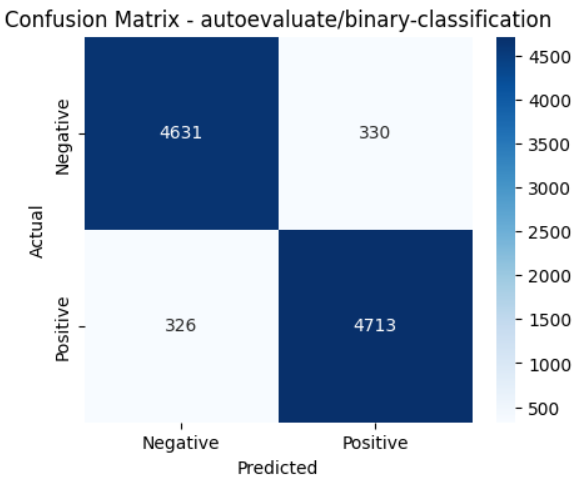
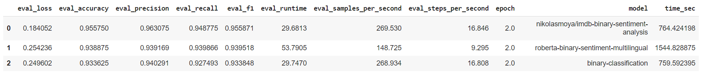

# 🎬 IMDb Sentiment Analysis with Transformers

This project performs **binary sentiment analysis** on the [IMDb Movie Reviews Dataset](https://www.kaggle.com/datasets/lakshmi25npathi/imdb-dataset-of-50k-movie-reviews) using state-of-the-art **Transformer-based models** from Hugging Face. The goal is to fine-tune and benchmark multiple models for classification accuracy, training speed, and robustness.

## 📌 Models Used

The following pre-trained models were fine-tuned and evaluated:

- [`nikolasmoya/imdb-binary-sentiment-analysis`](https://huggingface.co/nikolasmoya/imdb-binary-sentiment-analysis)
- [`kubi565/roberta-base-multilingual-sentiment`](https://huggingface.co/kubi565/roberta-binary-sentiment-multilingual)
- [`autoevaluate/binary-classification`](https://huggingface.co/autoevaluate/binary-classification)

## 🧪 Dataset

- **50,000** labeled movie reviews
- **Balanced**: 25,000 positive / 25,000 negative
- Split into training (80%) and test (20%)

## 🛠️ Methodology

- Used `transformers`, `datasets`, `Trainer`, and `PyTorch`
- Preprocessing: Tokenization, truncation to 512 tokens, attention masks
- Fine-tuned models for **2** using the Hugging Face `Trainer` API
- Evaluation based on test set performance

## 📈 Evaluation Metrics

| Model                                      | Loss      | Accuracy  | Precision | Recall    | F1 Score  | Time   |
|-------------------------------------------|-----------|-----------|-----------|-----------|-----------|--------|
| [`nikolasmoya/imdb-binary-sentiment-analysis`](https://huggingface.co/nikolasmoya/imdb-binary-sentiment-analysis) | 0.1841    | 0.9558    | 0.9631    | 0.9488    | 0.9559    | 764 s  |
| [`kubi565/roberta-base-multilingual-sentiment`](https://huggingface.co/kubi565/roberta-binary-sentiment-multilingual) | 0.2542    | 0.9389    | 0.9392    | 0.9399    | 0.9395    | 1544 s |
| [`autoevaluate/binary-classification`](https://huggingface.co/autoevaluate/binary-classification) | 0.2496    | 0.9336    | 0.9403    | 0.9275    | 0.9338    | 759 s  |

## 📊 Visualizations

- Confusion matrices for each model
  

  

  

  

- Benchmark summary
  

  

## 🧠 Conclusion

- The [`nikolasmoya/imdb-binary-sentiment-analysis`](https://huggingface.co/nikolasmoya/imdb-binary-sentiment-analysis) model achieved the best overall results in terms of accuracy and loss in our tests.
  - 📌 **Hugging Face official results:** Accuracy: `0.9338`, Loss: `0.2549`
  - ✅ **Our result:** Accuracy: `0.9558`, Loss: `0.1841`  
  → This improvement indicates effective fine-tuning and optimized preprocessing steps.
- The Hugging Face `Trainer` + `datasets` setup ensured a smooth and flexible fine-tuning workflow.
- Tokenization strategy and dataset preparation played a key role in model stability and overall generalization.

## 📚 References

- [IMDb Movie Reviews Dataset – Kaggle](https://www.kaggle.com/datasets/lakshmi25npathi/imdb-dataset-of-50k-movie-reviews/data)  
- [HuggingFace Model 1 – nikolasmoya/imdb-binary-sentiment-analysis](https://huggingface.co/nikolasmoya/imdb-binary-sentiment-analysis)  
- [HuggingFace Model 2 – clapAI/roberta-base-multilingual-sentiment](https://huggingface.co/kubi565/roberta-binary-sentiment-multilingual)  
- [HuggingFace Model 3 – autoevaluate/binary-classification](https://huggingface.co/autoevaluate/binary-classification)

---

## 👩‍💻 Contributors

| Name         | GitHub Profile                         | Role                |
|--------------|----------------------------------------|---------------------|
| Elif Yıldız  | [@Elifyildizz](https://github.com/Elifyildizz) | Developer / Researcher |
| Batuhan Saylam  | [@Batuhansaylam26](https://github.com/Batuhansaylam26) | Developer / Researcher |
---

## ⚠️ Disclaimer

This project is developed **for educational and research purposes only**.

- The dataset used is publicly available and was processed in accordance with open-source guidelines.
- All models are fine-tuned versions of publicly shared Hugging Face transformers and used strictly within research scope.
- The authors do **not take any responsibility** for misuse or unintended consequences resulting from the use of this repository.
- Do not use this project for commercial or unethical activities.

By using this codebase or content, **you agree to the above terms.**

